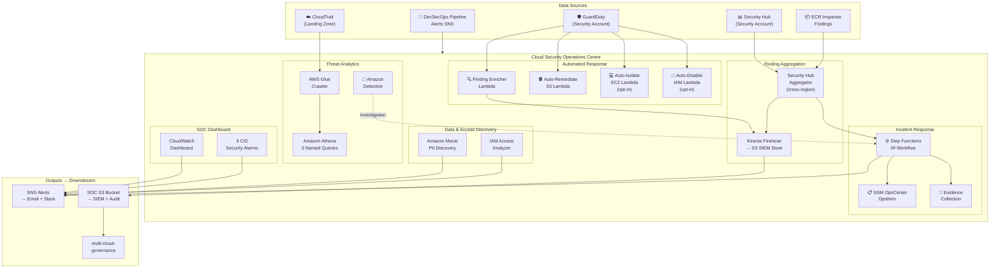
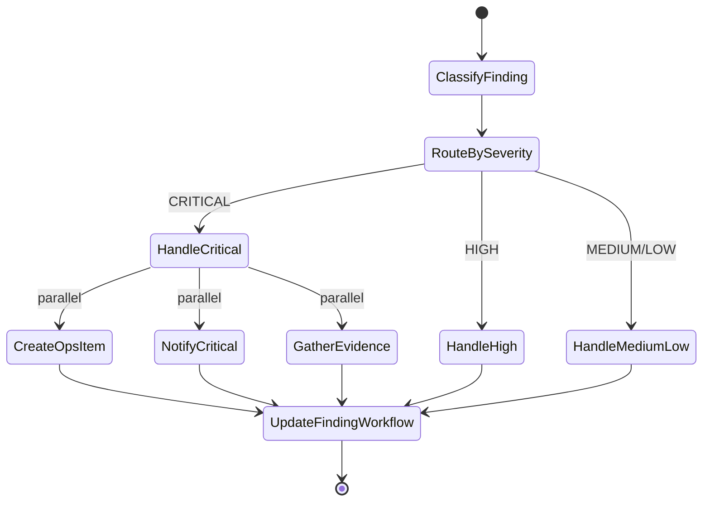
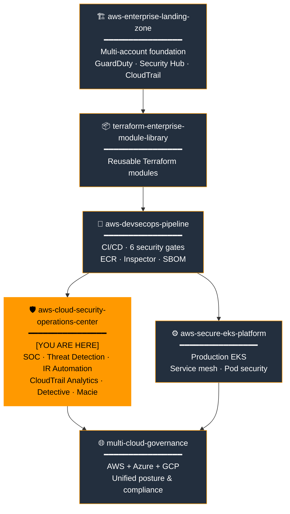
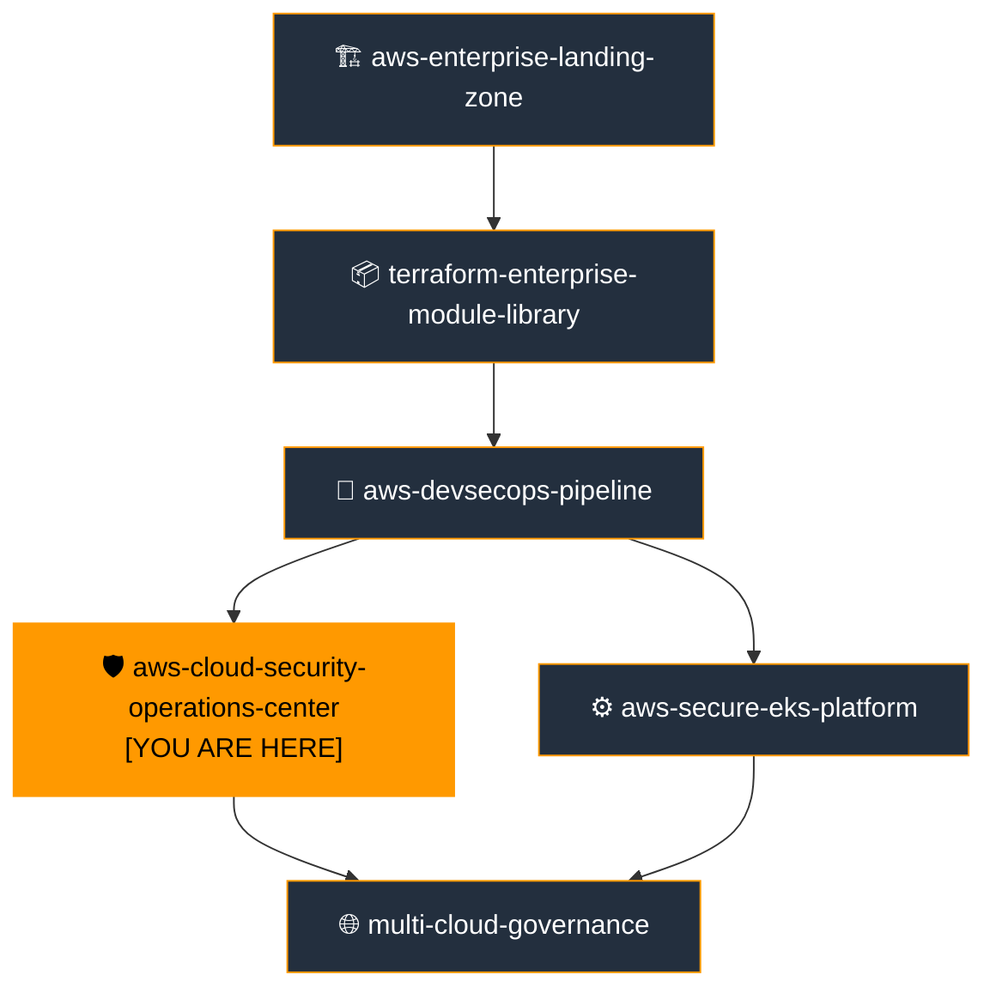

# AWS Cloud Security Operations Centre

[](https://github.com/e-mulenga/aws-cloud-security-operations-center/actions)
[](https://github.com/e-mulenga/aws-cloud-security-operations-center/actions)
[](LICENSE)
[](https://www.terraform.io)
[](https://registry.terraform.io/providers/hashicorp/aws)

> **Portfolio Position 4 of 6** — Enterprise Cloud Platform
> Centralised security operations centre consuming threat telemetry from the entire AWS estate and automating incident response.

---

## Table of Contents

1. [Executive Summary](#1-executive-summary)
2. [Business Problem](#2-business-problem)
3. [Solution Overview](#3-solution-overview)
4. [Architecture Overview](#4-architecture-overview)
5. [Enterprise Cloud Portfolio Position](#5-enterprise-cloud-portfolio-position)
6. [AWS Services Used](#6-aws-services-used)
7. [Service Selection Rationale](#7-service-selection-rationale)
8. [Terraform Structure](#8-terraform-structure)
9. [Deployment Guide](#9-deployment-guide)
10. [Validation Guide](#10-validation-guide)
11. [Security Controls](#11-security-controls)
12. [Monitoring & Observability](#12-monitoring--observability)
13. [Disaster Recovery Strategy](#13-disaster-recovery-strategy)
14. [Cost Optimization Strategy](#14-cost-optimization-strategy)
15. [Operational Runbooks](#15-operational-runbooks)
16. [AWS Well-Architected Review](#16-aws-well-architected-review)
17. [Skills Demonstrated](#17-skills-demonstrated)
18. [Interview Talking Points](#18-interview-talking-points)
19. [Future Enhancements](#19-future-enhancements)
20. [Related Repositories](#20-related-repositories)

---

## 1. Executive Summary

This repository delivers a **production-grade Cloud Security Operations Centre (CSOC)** built entirely on AWS-native security services, orchestrated with Terraform. It is the intelligence and response layer of the Enterprise Cloud Platform Portfolio — consuming security telemetry from the [AWS Enterprise Landing Zone](https://github.com/e-mulenga/aws-enterprise-landing-zone-terraform) and the [DevSecOps Pipeline](https://github.com/e-mulenga/aws-devsecops-pipeline), and exporting unified posture data to [multi-cloud-governance](https://github.com/e-mulenga/multi-cloud-governance).

**What this repository builds:**
- **Security Hub aggregator** — cross-region finding consolidation with Kinesis Firehose export to S3
- **GuardDuty automation** — 4 automated response Lambda functions with EventBridge routing
- **Step Functions IR workflow** — 6-step incident response state machine with full audit trail
- **CloudTrail analytics** — Athena + Glue with 5 pre-built CIS Section 4 named queries
- **Amazon Detective** — behaviour graph for post-incident investigation
- **Amazon Macie** — PII discovery with custom POPIA data identifiers
- **IAM Access Analyzer** — organisation-level external access detection
- **SOC command centre dashboard** — 9 CloudWatch metric filters + real-time security alarms
- **Automated S3 remediation** — blocks public access on GuardDuty findings without human intervention

**Automated response capabilities:**
- S3 public access → auto-remediated (safe, opt-in by default = `true`)
- EC2 compromise → forensic snapshot + network isolation (disruptive, opt-in = `false`)
- IAM credential compromise → DenyAll policy + key deactivation (disruptive, opt-in = `false`)
- CRITICAL findings → Step Functions IR workflow automatically triggered

---

## 2. Business Problem

### The Gap Without a CSOC

| Problem | Business Impact |
|---|---|
| Security findings spread across 5+ services per account | SOC analysts check 25+ tabs before any investigation begins |
| No automated response | Mean Time to Contain (MTTC) measured in hours, not minutes |
| No CloudTrail query capability | Forensic investigation requires log download + manual grep |
| No PII/sensitive data inventory | Regulatory exposure under POPIA, GDPR, PCI-DSS |
| External resource access goes undetected | S3 buckets, IAM roles shared outside Org not discovered until breach |
| No investigation tooling | Analysts correlate events manually — slow, error-prone |
| Security posture siloed per account | No enterprise-wide compliance score |

### Regulatory Drivers

| Regulation | Requirement | SOC Control |
|---|---|---|
| **POPIA (South Africa)** | Detect and report data breaches within 72 hours | Macie PII discovery + GuardDuty S3 finding automation |
| **PCI-DSS 4.0 §10** | Audit log review and anomaly alerting | CloudTrail analytics + 9 CIS metric alarms |
| **ISO 27001 A.16** | Documented incident response procedure | Step Functions IR state machine |
| **SOC 2 Type II** | Continuous monitoring evidence | Security Hub compliance score + finding export |
| **CIS AWS Foundations v1.4** | Section 4 monitoring controls | 9 CloudWatch metric filters |

---

## 3. Solution Overview

### Data Flow

```
Landing Zone Security Services          DevSecOps Pipeline
─────────────────────────────          ────────────────────
CloudTrail → S3 (Logging Acct)    →    ECR Inspector Findings
GuardDuty (Security Acct)         →    Pipeline Alerts SNS Topic
Security Hub (Security Acct)      →    SBOM / Vulnerability Data
AWS Config (All Accounts)              ↓
         ↓                        ↓
    ╔═══════════════════════════════════════╗
    ║   CLOUD SECURITY OPERATIONS CENTRE    ║
    ║                                       ║
    ║  Security Hub Aggregator              ║
    ║    → Kinesis Firehose → S3            ║
    ║    → EventBridge → IR Workflow        ║
    ║                                       ║
    ║  GuardDuty Automation                 ║
    ║    → Finding Enricher Lambda          ║
    ║    → Auto-Remediate S3                ║
    ║    → Auto-Isolate EC2 (opt-in)        ║
    ║    → Auto-Disable IAM (opt-in)        ║
    ║                                       ║
    ║  CloudTrail Analytics                 ║
    ║    → Glue Crawler → Athena            ║
    ║    → 5 Named Security Queries         ║
    ║                                       ║
    ║  SOC Dashboard (CloudWatch)           ║
    ║    → 9 CIS metric alarms              ║
    ╚═══════════════════════════════════════╝
                   ↓
    multi-cloud-governance
    (unified posture exports)
```

### Auto-Remediation Decision Matrix

| Finding | Risk | Auto-Action | Default | Rationale |
|---|---|---|---|---|
| S3 public access | Data exposure | Block-public-access | ✅ ON | Safe, reversible, non-disruptive |
| EC2 C2/backdoor | Active compromise | Forensic snapshot + isolate | ❌ OFF | Disruptive — prod outage risk |
| IAM credential theft | Active compromise | DenyAll + deactivate keys | ❌ OFF | Disruptive — may lock out engineers |
| CRITICAL finding | Unknown | Trigger IR state machine | ✅ ON | Workflow, not disruptive action |

---

## 4. Architecture Overview

### SOC Architecture



### Incident Response State Machine



---

## 5. Enterprise Cloud Portfolio Position



### Portfolio Position Detail

| Attribute | Value |
|---|---|
| **Position** | 4 of 6 — Intelligence & Response Layer |
| **Deploy after** | 1. Landing Zone, 2. Module Library, 3. DevSecOps Pipeline |

**Consumes from `aws-enterprise-landing-zone`:**
- `kms_key_arn` — encrypts all SOC data stores
- `cloudtrail_bucket_name` — source for Athena/Glue analytics
- `cloudtrail_log_group_name` — source for CloudWatch metric filters
- `guardduty_detector_id` — base detector extended with automation
- `security_account_id`, `logging_account_id`, `organization_id`

**Consumes from `aws-devsecops-pipeline`:**
- `alerts_topic_arn` — pipeline security gate failures routed to SOC SQS queue
- `ecr_repository_arns` — Inspector findings monitored by Security Hub aggregator

**Produces (consumed by `multi-cloud-governance`):**
- `critical_alerts_topic_arn` — unified critical alert stream
- `soc_bucket_name` — SIEM data lake (enriched findings, IR artefacts, SBOM)
- `security_posture_export_bucket` — compliance posture for cross-cloud governance
- `athena_workgroup_name` — CloudTrail query endpoint
- `incident_response_state_machine_arn` — IR workflow for cross-cloud incidents

---

## 6. AWS Services Used

| Service | Role in SOC |
|---|---|
| **AWS Security Hub** | Cross-region finding aggregation, CIS + FSBP + NIST compliance |
| **Amazon GuardDuty** | ML threat detection — S3, EC2, IAM, EKS, malware |
| **Amazon Kinesis Data Firehose** | Finding export stream → S3 SIEM store (compressed, partitioned) |
| **AWS Step Functions** | Visual IR workflow with retry, parallel steps, and execution history |
| **AWS Lambda (×4)** | Finding enricher, S3 remediation, EC2 isolation, IAM disablement |
| **Amazon EventBridge** | Finding routing — severity-based dispatch to automation and IR |
| **AWS Glue** | CloudTrail log catalogue (daily crawler) |
| **Amazon Athena** | SQL queries over CloudTrail logs with 5 named security queries |
| **Amazon Detective** | Behaviour graph for post-incident investigation |
| **Amazon Macie** | PII/sensitive data discovery with custom POPIA identifier |
| **AWS IAM Access Analyzer** | Organisation-level external resource access detection |
| **AWS Systems Manager OpsCenter** | Incident tracking integrated with IR workflow |
| **Amazon CloudWatch** | 9 CIS metric filters, alarms, SOC command centre dashboard |
| **Amazon SNS** | Critical and High alert topics — email, Slack, PagerDuty |
| **Amazon SQS** | Pipeline alert ingestion queue (decoupled, durable) |
| **Amazon S3** | SOC data lake: enriched findings, IR artefacts, Athena results |
| **AWS KMS** | CMK encryption for SOC bucket, Firehose, Lambda env vars |

---

## 7. Service Selection Rationale

Full rationale in [`architecture/service-selection-rationale.md`](architecture/service-selection-rationale.md).

### Key Decisions

| Decision | Chosen | Alternative | Reason |
|---|---|---|---|
| Finding stream | Kinesis Firehose | Lambda → S3 direct | Auto-batching, compression, partitioning; no data loss on S3 errors |
| IR orchestration | Step Functions | Lambda chaining | Visual audit trail, built-in retry, parallel execution |
| CloudTrail queries | Athena + Glue | OpenSearch / Splunk | No data movement; SQL on existing S3; $0 idle cost |
| Investigation | Detective | Manual Athena | Pre-computed entity graphs reduce MTTR from hours to minutes |
| PII discovery | Macie | Manual audit | ML-based; custom POPIA identifier; scheduled scanning |
| External access | Access Analyzer | Manual policy review | Continuous evaluation; API-queryable findings |

---

## 8. Terraform Structure

```
aws-cloud-security-operations-center/
├── provider.tf                          # terraform{} + 4 providers (SOC, mgmt, logging, DR)
├── variables.tf                         # 40+ variables — nothing hardcoded
├── main.tf                              # Orchestrates 10 modules + SOC S3 bucket + budgets
├── outputs.tf                           # 14 outputs consumed by multi-cloud-governance
├── terraform.tfvars.example             # NEVER commit terraform.tfvars
│
├── modules/
│   ├── notifications/                   # SNS critical + high topics, SQS queue, policies
│   ├── security-hub-aggregator/         # Cross-region aggregator, custom actions, Firehose
│   ├── guardduty-automation/            # 4 Lambda functions + EventBridge rules
│   ├── cloudtrail-analytics/            # Athena workgroup, Glue database + crawler, 5 named queries
│   ├── detective/                       # Behaviour graph + member account invitations
│   ├── macie/                           # Account, scheduled job, custom POPIA identifier
│   ├── access-analyzer/                 # Organisation analyzer + EventBridge → SNS
│   ├── incident-response/               # Step Functions state machine + orchestrator Lambda
│   ├── soc-dashboard/                   # 9 metric filters, alarms, CloudWatch dashboard
│   └── [all modules have main.tf, variables.tf, outputs.tf]
│
├── lambda/
│   ├── finding-enricher/handler.py      # Adds asset tags, owner, CloudTrail context
│   ├── auto-remediate-public-s3/handler.py   # Blocks public access + logs remediation
│   ├── auto-isolate-ec2/handler.py      # Forensic snapshot + deny-all SG (opt-in)
│   ├── auto-disable-iam-user/handler.py # DenyAll + deactivate keys (opt-in)
│   └── incident-orchestrator/handler.py # Step Functions task handler (classify/evidence/update)
│
├── environments/
│   ├── dev/   { backend.tf, terraform.tfvars.example }
│   ├── test/  { backend.tf, terraform.tfvars.example }
│   └── prod/  { backend.tf, terraform.tfvars.example }
│
├── .github/workflows/
│   ├── terraform-plan.yml               # PR gate: gitleaks + tfsec + checkov + plan
│   ├── terraform-apply.yml              # Apply: dev auto, test/prod gated + drift detection
│   └── security-scan.yml               # Daily: tfsec + checkov + bandit + trivy + gitleaks
│
├── architecture/
│   └── service-selection-rationale.md  # Full justification for every service
│
├── runbooks/
│   ├── incident-response-runbook.md    # P1/P2 runbooks with CLI commands
│   ├── threat-investigation-runbook.md # Athena queries, Detective, evidence collection
│   └── operational-runbook.md          # Day-2 operations, maintenance schedule
│
├── validation/
│   └── validate-soc.sh                 # Post-deploy: checks all 12 SOC controls
│
├── scripts/
│   └── bootstrap-state.sh              # S3 + DynamoDB + KMS remote state bootstrap
│
├── policies/iam/
│   └── soc-readonly-role.json          # Least-privilege SOC analyst role
│
├── .gitignore
├── CONTRIBUTING.md
├── SECURITY.md
└── README.md
```

### Design Decisions

- **All disruptive remediations default to `false`** — a false positive auto-isolating a prod EC2 instance is worse than the finding.
- **Lambda handlers are idempotent** — EventBridge may deliver duplicate events; all functions check current state before acting.
- **`for_each` over `count`** — all named resources (Lambda projects, Athena queries) use map-based iteration.
- **No `versions.tf`** — portfolio standard; `provider.tf` contains the `terraform {}` block.

---

## 9. Deployment Guide

### Prerequisites

- `aws-enterprise-landing-zone` deployed → note outputs: `kms_key_arn`, `cloudtrail_bucket_name`, `guardduty_detector_id`
- `aws-devsecops-pipeline` deployed → note output: `alerts_topic_arn`
- AWS CLI ≥ 2.15, Terraform ≥ 1.6.0, Python 3.9+

### Step 1 — Bootstrap Remote State

```bash
ENV=prod ORG=acme-enterprise AWS_REGION=af-south-1 \
  bash scripts/bootstrap-state.sh
```

### Step 2 — Configure Variables

```bash
cp terraform.tfvars.example environments/prod/terraform.tfvars

# Populate from landing zone outputs
LZ_DIR="../aws-enterprise-landing-zone-terraform"
terraform -chdir="${LZ_DIR}" output -json | python3 -c "
import json, sys
out = json.load(sys.stdin)
print(f'kms_key_arn = \"{out[\"kms_cloudtrail_key_arn\"][\"value\"]}\"')
print(f'cloudtrail_bucket_name = \"{out[\"cloudtrail_bucket_name\"][\"value\"]}\"')
print(f'guardduty_detector_id = \"{out[\"guardduty_detector_id\"][\"value\"]}\"')
"
```

### Step 3 — Deploy

```bash
terraform init -backend-config="environments/prod/backend.tf" -reconfigure

# Phase 1: Notifications first (SNS ARNs required by other modules)
terraform apply \
  -var-file="environments/prod/terraform.tfvars" \
  -target=aws_s3_bucket.soc_data \
  -target=module.notifications

# Phase 2: Full apply
terraform apply -var-file="environments/prod/terraform.tfvars"
```

### Step 4 — Enable Disruptive Remediations (Prod — explicit opt-in)

After testing in dev/test and confirming no false positives:

```bash
# Add to environments/prod/terraform.tfvars after validation
# auto_isolate_ec2_enabled = true   # Only after SOC team training
# auto_disable_iam_enabled = true   # Only after SOC team training
```

### Step 5 — Validate

```bash
ENV=prod ORG=acme-enterprise AWS_REGION=af-south-1 \
  bash validation/validate-soc.sh
```

---

## 10. Validation Guide

### Automated Post-Deploy Check

```bash
ENV=prod ORG=acme-enterprise AWS_REGION=af-south-1 bash validation/validate-soc.sh
# Checks: Security Hub, GuardDuty, Access Analyzer, SOC bucket (KMS + versioning),
#         SNS topics, Lambda functions, Athena workgroup, CloudWatch dashboard
```

### Test IR Workflow

```bash
# Trigger the IR state machine with a simulated CRITICAL finding
aws stepfunctions start-execution \
  --state-machine-arn "$(terraform output -raw incident_response_state_machine_arn)" \
  --input '{
    "detail": {
      "type": "TEST:SimulatedCriticalFinding",
      "severity": 9.0,
      "id": "test-finding-001",
      "accountId": "123456789012",
      "title": "SOC IR Workflow Test"
    }
  }' --region af-south-1
```

### Test Auto-Remediation (S3)

```bash
# 1. Disable block-public-access on a test bucket
aws s3api put-public-access-block --bucket "<TEST_BUCKET>" \
  --public-access-block-configuration BlockPublicAcls=false,IgnorePublicAcls=false,BlockPublicPolicy=false,RestrictPublicBuckets=false

# 2. Trigger GuardDuty simulated finding
aws guardduty create-sample-findings \
  --detector-id "<DETECTOR_ID>" \
  --finding-types "Policy:S3/BucketPublicAccess.Read" \
  --region af-south-1

# 3. Check remediation log in SOC bucket within 2 minutes
aws s3 ls "s3://$(terraform output -raw soc_bucket_name)/remediation-logs/s3/" --recursive
```

### Verify CloudTrail Analytics

```bash
# Confirm Glue crawler ran and Athena database exists
aws glue get-database \
  --name "$(terraform output -raw glue_database_name)" \
  --region af-south-1 \
  --query 'Database.Name'

# Run a named query
aws athena start-query-execution \
  --work-group "$(terraform output -raw athena_workgroup_name)" \
  --query-execution-context Database="$(terraform output -raw glue_database_name)" \
  --query-string "SELECT COUNT(*) as event_count FROM cloudtrail_logs LIMIT 1" \
  --region af-south-1
```

---

## 11. Security Controls

### Identity & Access

| Control | Implementation |
|---|---|
| Least-privilege Lambda roles | Custom IAM policy per Lambda; scoped to specific S3 paths and resources |
| SOC analyst read-only role | `policies/iam/soc-readonly-role.json` — DenyAll write actions |
| No long-lived credentials | GitHub Actions uses OIDC; Lambda uses execution role |
| Cross-account access | Explicit provider aliases with `OrganizationAccountAccessRole` |

### Data Protection

| Control | Implementation |
|---|---|
| SOC bucket encryption | KMS CMK from Landing Zone; bucket-key enabled |
| SOC bucket immutability | `s3:DeleteObject` denied in bucket policy |
| Firehose encryption | KMS CMK on delivery stream |
| Lambda env var encryption | KMS key applied to all Lambda functions |
| TLS-only SOC bucket | Bucket policy denies `aws:SecureTransport = false` |
| Log archive: 7-year retention | S3 lifecycle: STANDARD → STANDARD_IA (90d) → GLACIER (365d) → expire (2557d) |

### Automated Response Controls

| Control | Default | Justification |
|---|---|---|
| Auto-remediate public S3 | ✅ Enabled | Safe, reversible, confirmed no false-positive risk |
| Auto-isolate EC2 | ❌ Disabled | Disruptive — false positive = prod outage |
| Auto-disable IAM user | ❌ Disabled | Disruptive — false positive = engineer locked out |
| IR workflow trigger | ✅ Enabled | Informational workflow only; no disruptive actions |

### Governance

| Control | Implementation |
|---|---|
| All remediations logged | JSON record to `s3://<soc-bucket>/remediation-logs/` |
| Step Functions audit trail | All state transitions logged to CloudWatch + 90-day execution history |
| Security Hub finding workflow update | All handled findings set to `IN_PROGRESS` with note |
| Finding suppression requires comment | Glue suppression filters must include justification in description |

---

## 12. Monitoring & Observability

### SOC Command Centre Dashboard

`<org>-<env>-soc-command-centre` displays in real-time:
- Unauthorized API call rate (5-min rolling)
- Root account login events
- Console logins without MFA
- IAM policy change frequency
- Security group change events
- KMS key deletion attempts
- GuardDuty HIGH finding trend (7-day)
- Active CloudWatch security alarms

### CIS Section 4 Alarms (9 controls)

| Alarm | CIS Control | Threshold |
|---|---|---|
| Unauthorized API calls | 4.1 | ≥ 5 / 5 min |
| Root account login | 4.3 | ≥ 1 / 1 min |
| Console login without MFA | 4.2 | ≥ 1 / 5 min |
| IAM policy changes | 4.4 | ≥ 1 / 5 min |
| CloudTrail config changes | 4.5 | ≥ 1 / 5 min |
| S3 bucket policy changes | 4.8 | ≥ 1 / 5 min |
| Security group changes | 4.10 | ≥ 1 / 5 min |
| Network ACL changes | 4.11 | ≥ 1 / 5 min |
| KMS key deletion | 4.7 | ≥ 1 / 5 min |

### Alert Routing

```
GuardDuty severity ≥ 7  →  EventBridge → critical_alerts SNS → Email + Slack (P1)
Security Hub CRITICAL   →  EventBridge → Step Functions IR workflow
Security Hub HIGH       →  EventBridge → high_alerts SNS → Email (P2)
Macie PII finding       →  EventBridge → critical_alerts SNS → Email + DPO
Access Analyzer finding →  EventBridge → high_alerts SNS → Email
CW Alarm breach         →  critical_alerts SNS → Email + Slack
Pipeline failure        →  DevSecOps SNS → SOC SQS queue → processed by enricher
```

---

## 13. Disaster Recovery Strategy

### SOC Service Availability

| Service | RTO | RPO | DR Strategy |
|---|---|---|---|
| Security Hub | 0 (global) | N/A | Cross-region finding aggregator |
| GuardDuty | 0 (managed) | N/A | DR region detector enabled via LZ |
| SOC S3 bucket | 15 min | 0 (versioned) | S3 Cross-Region Replication to DR region |
| Kinesis Firehose | 30 min | 5 min (buffered) | Re-deploy from Terraform in DR region |
| Step Functions | 30 min | 0 (stateless) | Re-deploy from Terraform in DR region |
| Athena/Glue | 1 hour | Last crawler run | CloudTrail logs replicated to DR by Landing Zone |
| Lambda functions | 30 min | 0 (stateless, code in git) | Re-deploy from Terraform |

### State Recovery

All SOC infrastructure is stateless or backed by S3 versioning:

```bash
# Restore SOC bucket objects if accidentally deleted
aws s3api list-object-versions \
  --bucket "$(terraform output -raw soc_bucket_name)" \
  --prefix "enriched-findings/" \
  --query 'Versions[?IsLatest==`true`]'

# Re-run the Glue crawler to refresh CloudTrail catalogue
aws glue start-crawler \
  --name "$(terraform output -raw glue_crawler_name)" \
  --region af-south-1

# Re-apply IR workflow if SFN is lost
terraform apply -target=module.incident_response \
  -var-file="environments/prod/terraform.tfvars"
```

---

## 14. Cost Optimization Strategy

### SOC Service Cost Profile

| Service | Pricing | Dev Optimisation | Prod Configuration |
|---|---|---|---|
| Security Hub | $0.001/finding check | Reduced accounts | All accounts + all standards |
| GuardDuty | Volume per GB analysed | Fewer data sources | All data sources + malware |
| Kinesis Firehose | $0.029/GB | 5-min buffer (less API calls) | 5-min buffer + GZIP |
| Athena | $5/TB scanned | 10 GB query limit | Partition pruning by date |
| Detective | $1-3/account/month | Disabled in dev | Enabled with all members |
| Macie | $1.50/GB classified | Weekly schedule | Weekly scheduled scan |
| Lambda | Per invocation | ARM64 (20% cheaper) | ARM64 + reserved concurrency |
| Step Functions | $0.025/1K transitions | Reduced parallel steps | Full parallel IR workflow |
| SOC S3 | Storage + requests | 30-day retention | 7-year tiered retention |

### Estimated Monthly Cost

| Component | Dev (USD/mo) | Prod (USD/mo) |
|---|---|---|
| Security Hub | $5 | $25 |
| GuardDuty | $15 | $60 |
| Kinesis Firehose | $2 | $10 |
| Athena | $2 | $8 |
| Detective | $0 (disabled) | $15 |
| Macie | $0 (disabled) | $10 |
| Lambda (4 functions) | $1 | $3 |
| Step Functions | $1 | $3 |
| SOC S3 | $3 | $15 |
| CloudWatch | $5 | $15 |
| **Total** | **~$34/month** | **~$164/month** |

---

## 15. Operational Runbooks

| Runbook | File | Covers |
|---|---|---|
| Incident Response | [`runbooks/incident-response-runbook.md`](runbooks/incident-response-runbook.md) | P1/P2 CLI procedures: credential compromise, EC2 isolate, S3 public |
| Threat Investigation | [`runbooks/threat-investigation-runbook.md`](runbooks/threat-investigation-runbook.md) | Athena queries, Detective usage, evidence collection checklist |
| Operational | [`runbooks/operational-runbook.md`](runbooks/operational-runbook.md) | Daily tasks, adding accounts, tuning suppressions, Macie scans |

---

## 16. AWS Well-Architected Review

### Operational Excellence
- Infrastructure as Code — every SOC component is Terraform, no manual console configuration
- Pre-built Athena queries eliminate analyst-time spent writing SQL from scratch
- Step Functions execution history provides a complete timeline of every incident handled
- CloudWatch dashboard updated in real-time — no manual log polling required

### Security
- Least-privilege IAM for every Lambda function (scoped policies, not `*` on resources)
- All SOC data encrypted with KMS CMK; audit of every key use in CloudTrail
- Disruptive remediations require explicit Terraform variable opt-in — safe defaults
- SOC S3 bucket has `s3:DeleteObject` denied — findings cannot be erased

### Reliability
- GuardDuty and Security Hub are AWS-managed with 99.9%+ SLA
- Kinesis Firehose retries on S3 write failures — no finding loss
- Step Functions built-in retry with exponential backoff for Lambda failures
- All Lambda functions are idempotent — duplicate EventBridge events are safe

### Performance Efficiency
- Athena partitioned queries by date — queries scan only the relevant day's logs, not full history
- Kinesis Firehose GZIP compression — 60-80% storage reduction
- Lambda ARM64 (Graviton) — 20% better price-performance vs x86
- Glue crawler runs nightly — catalogue stays fresh without on-demand crawling

### Cost Optimization
- Athena 10 GB per-query limit enforced at workgroup level — runaway queries blocked
- SOC S3 lifecycle tiers data to STANDARD_IA at 90 days and GLACIER at 365 days
- Detective and Macie disabled in dev — high per-account cost not justified for testing
- Lambda reserved concurrency prevents cost spikes from unexpected finding floods

### Sustainability
- All SOC services are serverless — zero idle compute
- Kinesis Firehose batching reduces S3 API request count by 1000× vs per-event writes
- ARM64 Lambda uses less power per compute unit than x86

---

## 17. Skills Demonstrated

### Cloud Security Architecture
- Multi-layer SOC: prevention (SCPs) + detection (GuardDuty) + response (Step Functions) + analytics (Athena)
- Automated incident response without human bottleneck for safe remediation actions
- Finding enrichment pattern: raw GuardDuty event → contextualised ASFF finding → SIEM record
- CIS AWS Foundations Benchmark Section 4 implementation (9 metric filter controls)
- POPIA compliance tooling (Macie custom data identifier for SA ID numbers)

### Terraform Engineering
- Multi-provider pattern: SOC account, management account, logging account, DR region
- `data "archive_file"` for Lambda deployment packages (no pre-built binaries in git)
- Conditional module instantiation: `count = var.detective_enabled ? 1 : 0`
- Complex EventBridge `input_transformer` with multiple `input_paths` and templates
- Step Functions definition in Terraform `jsonencode` with dynamic ARN references

### Python / Lambda Engineering
- Idempotent remediation handlers (check state before acting)
- Cross-service orchestration: GuardDuty → EC2 describe → snapshot → SG replace → tag → SNS → S3
- Structured JSON logging with `default=str` for datetime serialisation
- Error isolation: each remediation step in `try/except` with partial success tracking

### DevSecOps
- Bandit SAST on Lambda Python code in CI pipeline
- GitHub Actions OIDC (no stored AWS credentials)
- tfsec + checkov on all Terraform modules
- Drift detection scheduled Mon–Fri with `terraform plan -detailed-exitcode`

---

## 18. Interview Talking Points

### "Walk me through how you built an automated incident response system on AWS."

> "The core design decision was separating the response tier by risk level. For safe, reversible actions like re-enabling S3 block-public-access, I set the default to automatically execute — a false positive costs nothing. For disruptive actions like EC2 isolation or IAM user disablement, I defaulted to off and require explicit Terraform variable opt-in. The trigger mechanism uses EventBridge rules scoped to specific GuardDuty finding types — so the S3 remediation Lambda only ever fires on `Policy:S3/BucketPublicAccess` findings, not on unrelated events. For CRITICAL findings, I orchestrated a Step Functions state machine that runs in parallel: creating an OpsCenter OpsItem for tracking, notifying the on-call team via SNS, and gathering CloudTrail evidence — all simultaneously. Step Functions gives me a visual execution history for every incident, so the post-incident review can see exactly what automated steps ran, when, and with what result."

### "How does the SOC consume data from the Landing Zone without tight coupling?"

> "The SOC is a consumer of outputs, not a modifier of the Landing Zone. I read the Landing Zone's Terraform outputs — KMS key ARN, CloudTrail bucket name, GuardDuty detector ID — and pass them as variables to the SOC. The SOC never modifies Landing Zone resources. For CloudTrail analytics, the Glue crawler reads the same S3 bucket the Landing Zone writes to — no data movement, no ETL, no duplication. EventBridge routes GuardDuty findings to SOC Lambda functions using the Security account's existing detector, which was provisioned by the Landing Zone. This loose coupling means the SOC can be updated and redeployed without touching the Landing Zone."

### "How do you ensure forensic evidence integrity during an incident?"

> "Three controls: first, the EC2 isolation Lambda creates EBS snapshots before touching the instance's network configuration. The sequence is snapshot → create-isolation-SG → modify-instance-attribute. If the isolation fails, the snapshot already exists. Second, the SOC S3 bucket has a deny-delete bucket policy — `s3:DeleteObject` and `s3:DeleteObjectVersion` are explicitly denied for all principals. Evidence records can't be erased even by the account root. Third, every remediation action writes a structured JSON record to the SOC bucket with timestamp, finding ID, actions taken, and original resource state — so restoration is possible after the investigation closes."

### "How would you reduce Mean Time to Contain for a credential compromise?"

> "If `auto_disable_iam_enabled` is true, the containing action — DenyAll policy attachment and access key deactivation — runs within 30 seconds of GuardDuty publishing the finding. Without automation, the SOC analyst has to: receive the SNS alert, log into the console, navigate to IAM, find the user, attach the policy, list and deactivate keys. Even with a skilled analyst that's 10–15 minutes, during which the attacker continues operating. The automated path reduces MTTC from 15 minutes to under 2 minutes. The manual path is preserved as the runbook fallback for the cases where automation isn't enabled."

---

## 19. Future Enhancements

| Enhancement | Priority | Pillar |
|---|---|---|
| AWS Security Lake (OCSF normalisation) | High | Security |
| OpenSearch for real-time finding search | Medium | Operational Excellence |
| Automated Security Hub suppression via Lambda | Medium | Operational Excellence |
| GuardDuty Malware Protection Extended (ECS) | Medium | Security |
| AWS Chatbot for Slack/Teams SOC channel | High | Operational Excellence |
| Threat intelligence feed integration (STIX/TAXII) | Low | Security |
| Automated compliance evidence packaging for auditors | Medium | Governance |
| Amazon Bedrock for natural-language finding analysis | Low | Performance |
| Cross-account GuardDuty custom threat intelligence | Low | Security |
| Automated forensic memory acquisition via SSM | Low | Security |

---

## 20. Related Repositories

### Enterprise Cloud Platform Portfolio



| Repository | Relationship | My Integration |
|---|---|---|
| **[aws-enterprise-landing-zone](https://github.com/e-mulenga/aws-enterprise-landing-zone-terraform)** | Upstream — provides KMS, GuardDuty, Security Hub, CloudTrail | `kms_key_arn`, `guardduty_detector_id`, `cloudtrail_bucket_name` consumed as variables |
| **[terraform-enterprise-module-library](https://github.com/e-mulenga/terraform-enterprise-module-library)** | Upstream — reusable modules | `kms`, `s3`, `guardduty`, `security-hub` modules referenced |
| **[aws-devsecops-pipeline](https://github.com/e-mulenga/aws-devsecops-pipeline)** | Upstream — pipeline alerts | `alerts_topic_arn` subscribed to SOC SQS queue |
| **[aws-cloud-security-operations-center](https://github.com/e-mulenga/aws-cloud-security-operations-center)** | **YOU ARE HERE** | — |
| **[aws-secure-eks-platform](https://github.com/e-mulenga/aws-secure-eks-platform)** | Sibling — EKS findings in Security Hub | EKS GuardDuty findings appear in SOC aggregator |
| **[multi-cloud-governance](https://github.com/e-mulenga/multi-cloud-governance)** | Downstream — consumes posture exports | `critical_alerts_topic_arn`, `soc_bucket_name`, `security_posture_export_bucket` |

---

## Author

**Emmanuel Mulenga** — Multi-Cloud Engineer
- 🌐 [](https://www.linkedin.com/in/emmanuel-mulenga)
- 💻 [](https://github.com/e-mulenga)

---

*AWS Cloud Security Operations Centre — Enterprise Cloud Platform Portfolio | Position 4 of 6*
